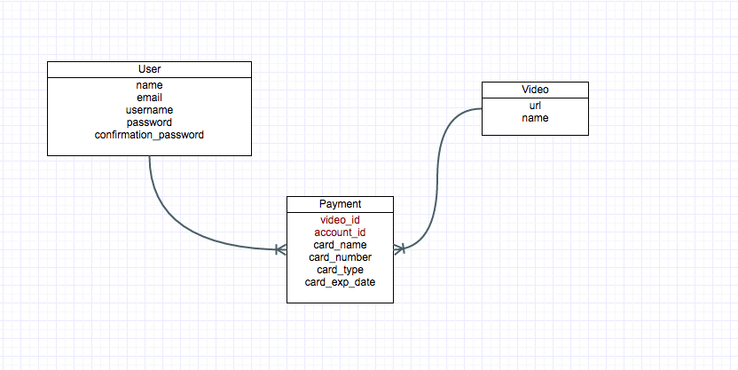

#Pay and Watch

##Purpose
To build an application focused on giving users the opportunity to personalize their videos that he/she likes separating them in profile accounts. Furthermore, to obtain the ability and learning knowledge of the ruby on rails framework.

##Description
A ruby on rails web app that allows users to Login and choose from a variety of videos in which they can pay by credit card to see and enjoy its content.
***

##Models
There are 3 models used on this application

1. **User**: There are two types of users --> Admin and User.
	1. **Admin**: It's in charge of uploading the videos to the home page.
	2. **User**: It's the current user account that must pay to watch the content of the video. 
2. **Payment**: It is the middleware model between users and videos.
3. **Video**: It is the model that contains the videos.

##Github Repository
######[https://github.com/yannycastrillon/pay-and-watch.git]()

##Users Stories
Trello was the application used to plan out and execute each user stories.
[https://trello.com/b/Z1j4lGem/video-payment-project-ruby-on-rails]()
Some of them were:

 1. **As client I want each user to list all videos that he had payed for.**
 2. **As a client I want to have a session for the user to navigate on the video page.**
 3. **As client I want a Payment model.**
 4. **As client I want users to be LOGIN to be able to see all videos from the page.**
 5. **As client I want to have a video model.**
 6. **As client I want user to login into my application "pay-and-watch".**
 7. **As client I want to create users account.**
 8. **As client I want to have a payment page where clients can enter their credit card information.**
 9. **As client I want to have a payment page where clients can enter their credit card information.**
 10. **Create and display layout of Create Account and Login Page.**

##Dificulties found along the way

* Understand the herarchy flow of the ruby on rails framework.
* Management of validation messages and showing them to the end user (link_to method).
* Understanding passing parameters through the URL and the Session variable.
* Using boostrap and CSS to make it look good specially regarding the layout.
* Footer is not sticking to the bottom.
* Overwhelming code!!! 
* Keeping It Simple.

##Instructions to execute code
* Download the repository to your preferred directory from Github.
* Open a terminal, go to your proyect's directory and run `bundle install` --> Install all your dependencies gems.
* Create some videos on the rails console before launching the site. (For the moment this will be the Admin job).
* Run `rails console`.
* Start Postgres local server.
* Must run this command `rake db:migrate` to create the tables and columns on Postgres Database. 
* Run: `Video.create(name:"video_name", url:"http://www.youtube.com", price:1.00)`
* After creating a couple of videos as an 'Admin' then you can `exit` the rails console.
* Later you must run:
* `rails s`  for the application to work on "Localhost:3000".
* Create an account and start buying videos. 

##Future features to develope
* Search bar on the navigation bar to look for a video.
* Implement pagination concept for certain amount of videos.
* User admin to be able to create videos from app and not from the console.
* Conect to a third party API and manage all the real transactional payment process.

